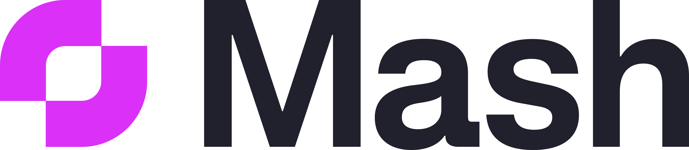

  

  Earn more for what you build, create and develop.   Gain more customers because there’s no commitment barrier.

 

# Overview

Mash is the monetization platform for developers, indie-hackers, creators, builders who want to earn for their content, apps & experiences based on the value that they provide and learn what users love most. You can charge any amount, add usage-based-pricing to monetize any event, action or click without requiring your users to make large-up-front purchases or input credit card details every time. Mash unlocks the fastest way to monetize experiences and get donations from your users, because their money is immediately available in your experience, and they can set a budget to auto-pay or auto-donate without interruption. It's your pricing, your experiences, your decisions, your control. 

# How do I get started?

Set up your account, your pricing & monetization model, and more. If you haven’t set up your account or want to change your settings or monetization model, you can do so at https://wallet.getmash.com/earn.  

If you are a developer looking to add Mash to your site the best place to start is to integrate the Mask SDK into your site. The SDK is bundled as a NPM pkg and can be found [here](./packages/client-sdk)

If you are looking for more general guides on how on how to integrate Mash, product solutions, please visit our [public guides](https://guides.getmash.com)

If you are looking for pre-built UI components & widgets please visit our [UI Components Library](https://docs.getmash.com)

# How are people monetizing with Mash?

## App & Tool Monetization
Builders, Developers & Indiehackers are charging users per use of a tool or experience instead of subscriptions to remove the large up-front purchase commitment barrier, and earn from those that want to use that experience just those few times. 

You can monetize any action, event or click – and even layer in auto-pay for when users have a budget set. 

You can see a few live examples at [Mashing Monster](https://mashingmonsters.com) and [Prophecy Bitcoin](https://prophecybitcoin.com). 

## Content Monetization
Creators of all kinds are monetizing their content in new and exciting ways. Mash provides pre-built monetization widgets, or you can create your own easily. You set pricing and they pay-as-they-enjoy to access an article, watch a great video, and even to get secret details like your email. You can have your users support you automatically, or with one-click for your amazing experiences.

* **Articles & Blog Posts** – From a review of your favourite products, to a how-to guide or recipe. Hide some content in a section or an entire post.
* **Hidden Page** – ask users to contribute to see everything on a secret page of anything from behind the scenes footage, or pre-released content.
* **Downloads** – Share high-quality assets for a fee. For cheat sheets, mods, image assets, filter packs and more.
* **Video & Audio** – For premium deep-dives, behind the scenes content and more
* **Links** – Have a great resource to share but want users to contribute a small bit ask users to contribute for premium links to resources.
* **Books & Guides** – Authors are monetizing their experiences per chapter or page. You can get started easily with our open-source [Book Starter Gatsby Repo](https://github.com/getmash/mash-lightning-book-starter).

## Boosts & Donations
* **Boosts** – Let your users one-click-donate to you, without requiring a confirmation. You'll learn what they love, and they'll get the satisfaction of supporting you. 
* **Donate Buttons** – Let them say thanks, but a bit more than the boost.
* **Donations Everywhere** – Share your lightning address, lightning QR code and Mash Page URL with your users to let them support you directly from all your channels, including Twitter, Reddit, Instagram, Facebook, Stackoverflow, Github… you name it!

